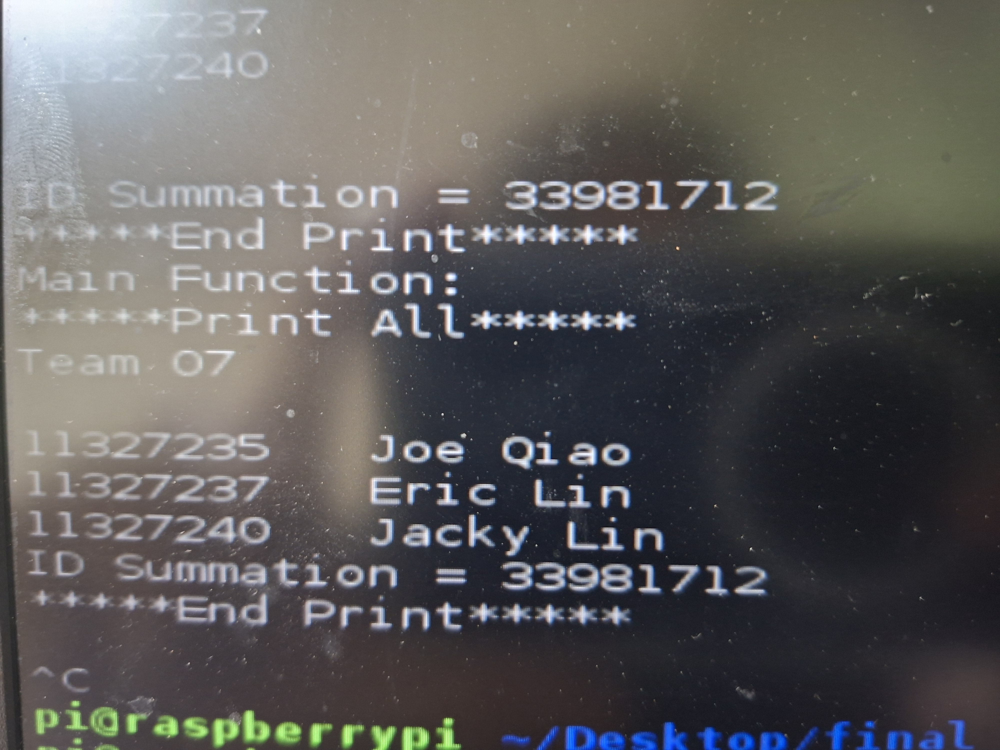
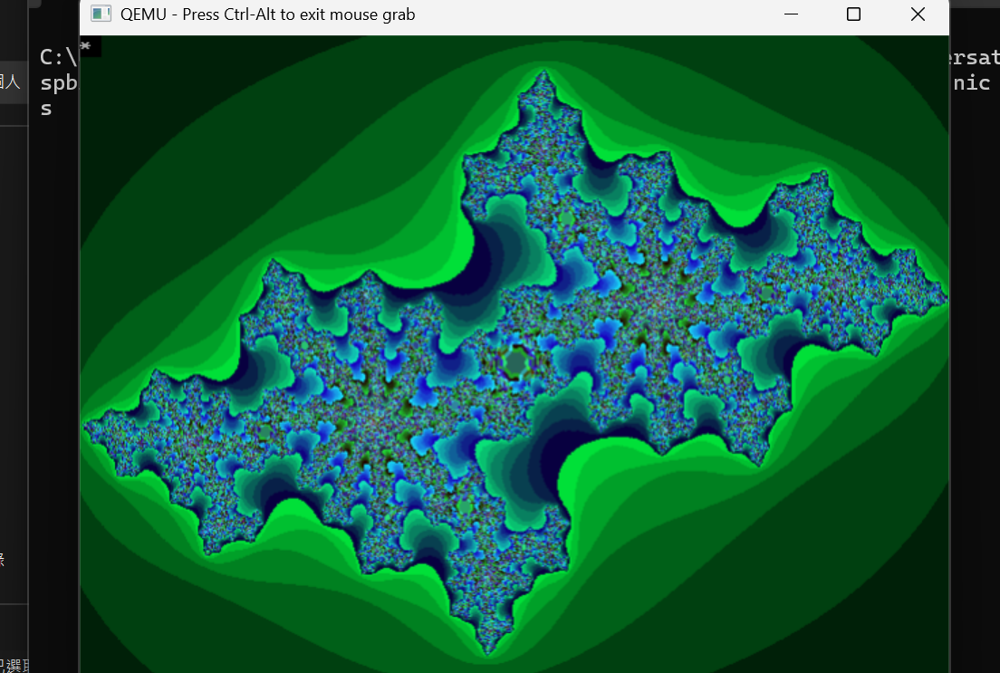

# ALE Final Project: Julia Set Animation on ARM

This repository contains the final project for the **Assembly Language and Embedded Systems (114-1)** course. The project demonstrates mixed-language programming (C and ARM Assembly) to calculate and render a dynamic Julia Set fractal directly to the Linux Frame Buffer on a Raspberry Pi.

## 📝 Project Overview

The application performs two main tasks:
1.  **Administrative Functions:** Accepts team member IDs, calculates their sum, and displays team information using ARM Assembly.
2.  **Fractal Rendering:** Renders a dynamic Julia Set animation. It uses a C wrapper to handle the main loop and I/O, while the computationally intensive fractal calculation is optimized in ARM Assembly.

## 📸 Demo & Screenshots

### 1. Terminal Interaction (Result Images)
The program handles user input for student IDs and displays the final team info overlay.

| **ID Input & Summation** | **Final Execution Result** |
| :---: | :---: |
|  |  |
| [cite_start]*User inputs IDs and calculates summation [cite: 302-306]* | [cite_start]*Final screen with "Happy New Year" & team info * |

### 2. Julia Set Animation
The application renders a shifting fractal pattern by modifying the `cY` parameter in real-time.

| **Animation Frame A** | **Animation Frame B** |
| :---: | :---: |
|  |  |
| [cite_start]*Fractal rendering using fixed-point arithmetic [cite: 310-312]* | *Different stage of the animation loop* |

## 📂 File Structure

* **`main.c`**: The entry point of the program. It handles:
    * Calling assembly functions (`NAME`, `ID`, `drawJuliaSet`).
    * Opening the Frame Buffer device (`/dev/fb0`).
    * [cite_start]The main animation loop which modifies the `cY` parameter to create movement[cite: 324].
* **`drawJuliaSet.s`**: The core rendering engine.
    * Iterates through every pixel (640 x 480).
    * [cite_start]Uses **fixed-point arithmetic** (scaling by 1000 or 1500) to simulate floating-point calculations for the Julia Set formula $f(z) = z^2 + c$[cite: 311].
    * Writes 16-bit color values directly to the frame buffer memory.
* **`id.s`**: Handles user input.
    * Reads three student IDs, calculates the summation, and prints the result upon receiving the command 'p'.
    * [cite_start]Demonstrates stack manipulation and specific instruction usage (`rsbs`)[cite: 307].
* **`name.s`**: A simple assembly routine to print the team name ("Team 07") and member names.

## ⚙️ Technical Implementation & Constraints

This project was built under specific academic constraints to demonstrate mastery of ARM Assembly:

* [cite_start]**Fixed-Point Arithmetic:** Since the target environment emphasizes integer processing, floating-point operations for the fractal generation are simulated using integer math (scaling factors of 1000/1500)[cite: 311].
* [cite_start]**Frame Buffer I/O:** The program bypasses high-level graphics libraries, writing raw pixel data directly to `/dev/fb0` using system calls (`open`, `write`, `lseek`)[cite: 325].
* **Assembly Constraints:**
    * Manual stack management (no `push`/`pop`, used `stmfd`/`ldmfd`).
    * [cite_start]Implementation of specific ARM instruction features, including **Operand2** shifts and **Conditional Execution** on non-branch instructions [cite: 350-363].
    * [cite_start]Specific usage of `rsbs sp, lr, pc` for return address handling in `id.s`[cite: 307].

## 🚀 How to Run

### Prerequisites
* **Hardware:** Raspberry Pi (or similar ARM-based embedded system).
* **OS:** Linux with Frame Buffer access enabled.

### Compilation
The project combines C and Assembly files. You can compile it using `gcc`:

```bash
gcc -o ale_final main.c name.s id.s drawJuliaSet.s
